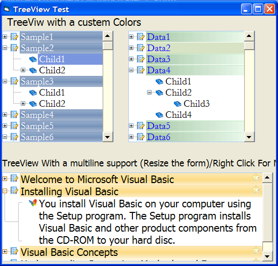



## MultiLine TreeView User Control \*\[Updated\]\*

### Description

Hi all,the Multiline Treeview will help you to outline your data by including them inside the nodes,just like the normal TreeView, but with a major difference it will breakdown the large one lines to multiline(See the Screen Shot),also supports right to left alignment. Suggestions and votes are welcomed. Zyad.
 
### More Info
 

             |
---                |---
**Submitted On**   |2006-03-06 00:55:54
**By**             |[Zyad Sayd](https://github.com/Planet-Source-Code/PSCIndex/blob/master/ByAuthor/zyad-sayd.md)
**Level**          |Advanced
**User Rating**    |4.8 (110 globes from 23 users)
**Compatibility**  |VB 6\.0
**Category**       |[OLE/ COM/ DCOM/ Active\-X](https://github.com/Planet-Source-Code/PSCIndex/blob/master/ByCategory/ole-com-dcom-active-x__1-29.md)
**World**          |[Visual Basic](https://github.com/Planet-Source-Code/PSCIndex/blob/master/ByWorld/visual-basic.md)
**Archive File**   |[MultiLine\_197801352006\.zip](https://github.com/Planet-Source-Code/zyad-sayd-multiline-treeview-user-control-updated__1-64505/archive/master.zip)

